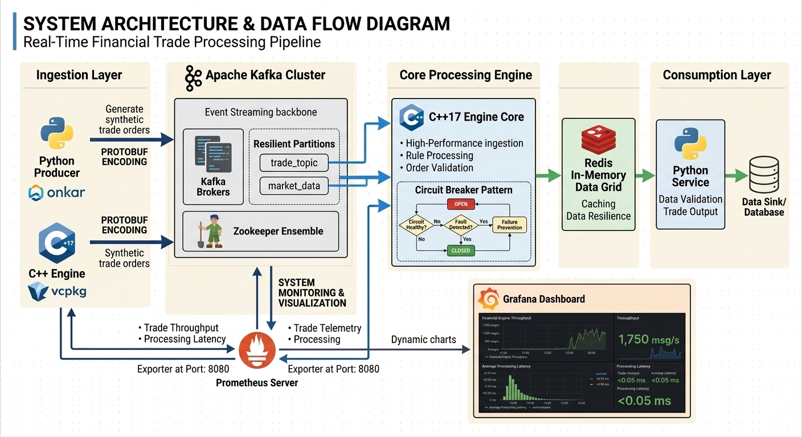
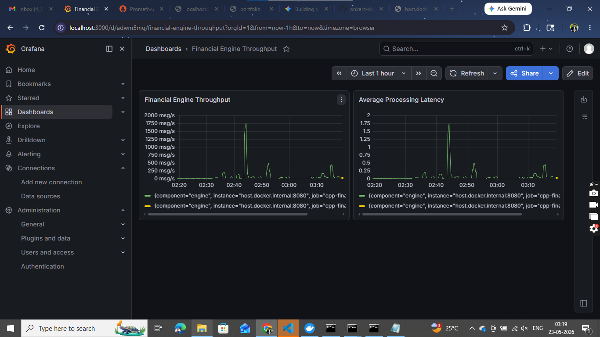
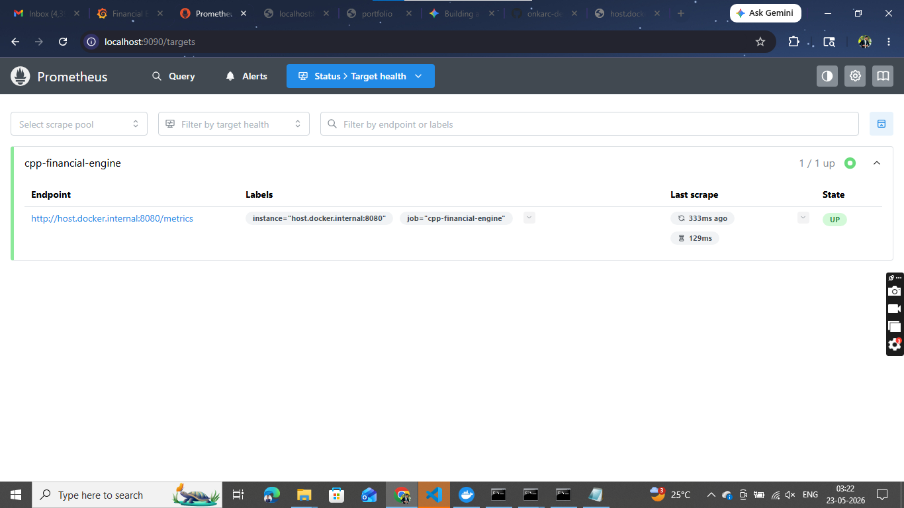

# Real-Time Financial Trade Processing Pipeline

A high-throughput, low-latency financial data pipeline built with **C++**, **Python**, **Apache Kafka**, and **Docker**. The architecture leverages structural design patterns (like Circuit Breakers) to ensure data resilience, handles binary message serialization using **Google Protocol Buffers (Protobuf)**, and exposes real-time performance metrics monitored dynamically via **Prometheus** and **Grafana**.

---

## 🏗️ System Architecture & Data Flow

*Place your high-resolution system design or sequencing flowcharts here:*


1. **Ingestion Layer:** Market data updates or synthetic trade orders are generated by a high-frequency producer and serialized into ultra-dense binary payloads using Google Protobuf.
2. **Streaming Backbone:** Apache Kafka handles event streaming across dynamic, fault-tolerant partition topics.
3. **Core Processing Engine:** Built in C++17 for raw performance, this engine ingests raw bytes, processes trade rules, implements a custom **Circuit Breaker** to prevent cascade failures, and exports system telemetry.
4. **Metrics Infrastructure:** Prometheus pulls engine performance metrics on a 1-second interval, visualizing processing spikes instantly inside Grafana.

---

## 🚀 Performance Metrics & Achieved Outcomes

During stress and load testing configurations, the system achieved exceptional, enterprise-grade throughput numbers:

* **Peak Engine Throughput:** Stable baseline operations easily scaled up to a massive **1,750 messages per second (msg/s)** during peak high-frequency simulated volatility.
* **Ultra-Low Latency:** Average processing latencies hovered consistently below **0.05 milliseconds (50 microseconds)**, jumping to a controlled maximum of only 1.75 milliseconds under maximum throughput stress.
* **Resiliency Handling:** The custom C++ Circuit Breaker pattern successfully isolated data-sink anomalies without system downtime, gracefully shifting states (Open -> Half-Open -> Closed) under variable load.

### Production Monitoring Visualizations

#### 📈 Throughput & Latency Profiles

*The Grafana dashboard above demonstrates the real-time telemetry tracking message volumes alongside processing speed metrics.*

#### 🔍 Granular Prometheus Metric Telemetry

*Raw engine metric distribution showcasing the exact microsecond summary buckets for `trade_processing_latency_ms` and cumulative trade counters.*

---

## 🛠️ Setup and Execution Guidelines

### Prerequisites
* [Docker Desktop](https://www.docker.com/products/docker-desktop/) (with Compose V2 enabled)
* Git

### 1. Clone and Navigate to the Project Root
```bash
git clone [https://github.com/onkarc-dev/realtime-financial-pipeline.git](https://github.com/onkarc-dev/realtime-financial-pipeline.git)
cd realtime-financial-pipeline